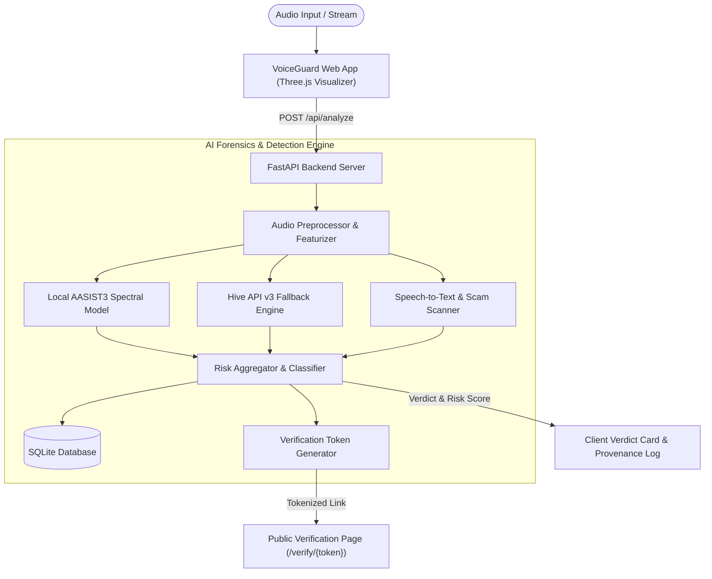

# 🛡️ VoiceGuard AI — Real-Time Audio Deepfake & Voice Clone Detection

[](https://krish3567.github.io/VOICEGUARD-AI/)

[](LICENSE)
[](https://www.python.org/downloads/)
[](https://fastapi.tiangolo.com)
[](https://pytorch.org/)
[](https://threejs.org/)

**VoiceGuard** is an advanced AI audio forensics platform engineered to protect individuals, contact centers, and financial institutions against voice cloning, generative deepfake speech, and social engineering fraud in real time.

---

## 🌟 Key Features

- **🎙️ Dual-Engine Deepfake Analysis**
  - **Local Deep Learning Model**: Uses `Spectra-AASIST3` to inspect spectral artifacts, vocoder traces, and phase anomalies directly on-premise without cloud latency.
  - **Cloud Multi-Modal Verification**: Integrates with **Hive API v3** as an enterprise-grade secondary verification engine.
- **🛡️ Phishing & Scam Keyword Detection**
  - Continuous speech-to-text pipeline (Google Cloud STT & fallback engines) scanning for social engineering triggers (e.g., emergency funds, OTP / PIN extraction, wire transfers, urgent authority claims).
  - Dynamic risk-score boost factoring semantic fraud heuristics alongside acoustic likelihood scores.
- **🔍 Cryptographic Audio Provenance & History Log**
  - Every evaluated clip generates an in-browser and backend content fingerprint (SHA-256).
  - Maintains a tamper-evident audit timeline: captures initial upload, re-analyses, analyst flags, and model versions over time.
- **📜 Shareable Trust Badges & Public Verification Reports**
  - Generates immutable verification snapshots with unguessable cryptographic tokens (`/verify/{token}`) and a 90-day time-to-live (TTL).
  - Public-facing verification page designed for media sharing, press verification, or dispute resolution.
- **📁 Enterprise Bulk Scanning**
  - Parallel multi-file analysis (up to 20 files simultaneously) with aggregate verdict metrics and CSV report export.
- **📊 Security Audit & Operations Analytics**
  - Dedicated Operations Review Queue (`review-queue.html`) for incident responders and fraud teams.
  - Real-time analytics dashboards tracking genuine vs. clone ratios, risk distributions, and detection latencies.
- **🌊 Interactive 3D Audio Visualizer**
  - Three.js dynamic spectral canvas displaying real-time frequency distribution during live recording and audio playback.

---

## 🏗️ Architecture Overview



---

## 📂 Project Structure

```text
voiceguard/
├── backend/
│   ├── .env.example        # Environment variables template
│   ├── create_key.py       # API key management CLI
│   ├── db.py               # SQLite schema, migrations & data layer
│   ├── detector.py         # AI detection logic (AASIST3, Hive API, STT)
│   ├── main.py             # FastAPI REST endpoints & routes
│   ├── requirements.txt    # Python backend dependencies
│   └── voiceprint.py       # Speaker embedding extraction & comparison
├── analytics.html          # Operational analytics dashboard
├── analytics.js            # Analytics chart rendering & metrics fetching
├── bg-signal.js            # Background telemetry & event bus
├── CHANGES.md              # Detailed release & feature history
├── index.html              # Main application interface & live scanner
├── logo.png                # VoiceGuard brand asset
├── redesign.css            # Modernized UI theme styles
├── review-queue.css        # Review queue styling
├── review-queue.js         # Review queue triage logic
├── script.js               # Core client logic, recording, 3D visualizer
├── security-audit.js       # Security auditing client module
├── style.css               # Core styling & responsive layouts
├── three.min.js            # Three.js 3D graphics library
├── verification-report.css # Verification report modal styling
└── README.md               # Project documentation
```

---

## 🚀 Quick Start Guide

### 1. Prerequisites
- Python 3.9+ installed
- Modern web browser (Chrome, Edge, Firefox, or Safari) with Web Audio API support

### 2. Backend Setup

1. **Clone the repository**:
   ```bash
   git clone https://github.com/KRISH3567/VOICEGUARD-AI.git
   cd VOICEGUARD-AI
   ```

2. **Create and activate a virtual environment**:
   ```bash
   # Windows
   python -m venv venv
   .\venv\Scripts\activate

   # macOS/Linux
   python3 -m venv venv
   source venv/bin/activate
   ```

3. **Install Python dependencies**:
   ```bash
   pip install -r backend/requirements.txt
   ```

4. **Configure Environment Variables**:
   Create a `.env` file in the `backend/` directory from `.env.example`:
   ```bash
   cp backend/.env.example backend/.env
   ```
   Edit `backend/.env` to configure optional external services (Hive API or Google Speech-to-Text):
   ```ini
   XLSR_MODEL_ID=lab260/Spectra-AASIST3
   HIVE_API_KEY=your_hive_api_key_here
   HIVE_API_URL=https://api.thehive.ai/api/v3/hive/ai-generated-and-deepfake-content-detection
   GOOGLE_STT_API_KEY=your_google_api_key_here
   GOOGLE_STT_PRIMARY_LANGUAGE=en-IN
   ```
   *(Note: VoiceGuard works out-of-the-box using the local acoustic model even without external API keys!)*

5. **Start the FastAPI backend server**:
   ```bash
   uvicorn backend.main:app --reload --host 127.0.0.1 --port 8000
   ```
   The backend API documentation is available at:
   - Interactive Swagger UI: `http://127.0.0.1:8000/docs`
   - ReDoc: `http://127.0.0.1:8000/redoc`

### 3. Launch the Frontend

Open `index.html` in your browser:
- Directly in your browser, or
- Serve using Python or VS Code Live Server:
  ```bash
  python -m http.server 3000
  ```
  Visit `http://localhost:3000` in your web browser.

---

## 🔌 API Endpoints Summary

| Method | Path | Description |
|---|---|---|
| `POST` | `/api/analyze` | Analyzes a single audio clip (WAV/MP3/OGG/M4A) for deepfake patterns & scam phrases. |
| `POST` | `/api/batch-analyze` | Analyzes up to 20 files concurrently, returning per-file & aggregate scores. |
| `GET` | `/api/batch/{id}/report.csv` | Downloads batch analysis results formatted as a CSV file. |
| `GET` | `/verify/{token}` | Public, shareable, immutable verification report snapshot. |
| `GET` | `/api/audio/{id}/provenance` | Retrieves cryptographic edit and analysis history for a given clip hash. |
| `POST` | `/api/audio/{id}/flag` | Allows fraud reviewers to flag or annotate false positive/negative clips. |
| `GET` | `/api/analytics/summary` | Telemetry & operational metrics for genuine vs. clone rates. |
| `POST` | `/api/feedback` | Records user feedback to help continually improve detection accuracy. |

---

## 🔒 Security & Privacy Notice

- **Audio Data Handling**: VoiceGuard processes audio in-memory for deepfake and acoustic analysis. By default, raw audio is not persisted permanently; only cryptographic SHA-256 hashes and evaluation metrics are recorded.
- **Local-First Privacy**: When running the local model (`Spectra-AASIST3`), audio never leaves your machine.

---

## 📄 License

This project is licensed under the MIT License — see the [LICENSE](LICENSE) file for details.
